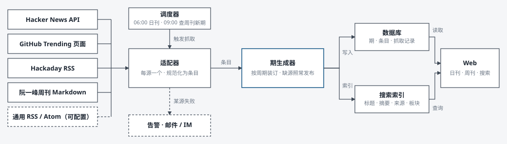
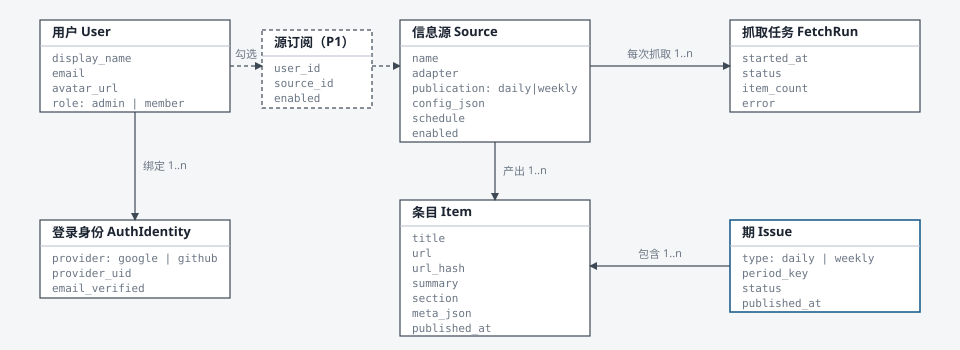

# lowpass MVP 产品需求文档

| 产品名 | 版本 | 状态 | 日期 | 起草 | 审核 |
|---|---|---|---|---|---|
| lowpass | v0.3.4 草案 | 细化版，待审核 | 2026-09-09 | Claude（PM 视角） | 产品负责人 |

> lowpass 是一个属于自己的技术刊物站：每天早上把 Hacker News、GitHub Trending、Hackaday 装订成一期日刊，每周把阮一峰科技爱好者周刊收进周刊。信息源可配置，历史内容可模糊搜索，用 Google 或 GitHub 登录。第 0 节记录了已确认的边界决策。

**版本说明。** v0.2.2 是已终审的范围基线。v0.3 不改变范围与第 0 节的决策，把文档细化到可开发、可测试的粒度：每个模块补充用户故事、业务规则、异常边界与验收标准；新增页面规格、状态定义、规范化条目契约、告警规则、埋点、上线清单与界面文案。细化时不得不做的新默认决定集中在第 12 节，均可推翻。技术选型仍由产品负责人决定，本文只写行为与约束。

**阅读指引。** 只看范围：第 0、1、4 节。开发：第 3、5、6、7、8 节与附录 A、B。测试与验收：第 5 节各小节的 AC、第 10 节的退出清单与上线清单。

**编号约定。** F-xx 为功能编号；R-x.y 为业务规则；AC-x.y 为验收标准，按"前提 / 操作 / 预期"书写；D 为决策。在线版（可评论）仍停留在 v0.2.2 基线：https://claude.ai/code/artifact/54c5408e-28a5-4d70-b240-97af6dee029a 。本文件是唯一源文件。架构决策与技术选型见 `docs/adr/0001-mvp-tech-stack.md`（已接受）。

## 0. 决策记录

以下 7 项已于 2026-09-08 由产品负责人确认，构成 MVP 的边界。后续如需改动，更新本记录并升版本号。D15、D16 是之后由产品负责人补充的决定。

| 编号 | 问题 | 结论 | 落点 |
|---|---|---|---|
| D1 | 谁能阅读内容 | 登录后可读。内容对外不可见，分享给朋友需要对方登录。 | 5.4 权限、5.5 未登录跳转、6.1 权限列 |
| D2 | 信息源由谁配置 | 管理员维护全局源目录；普通用户在目录内勾选想看的源，勾选功能列 P1。MVP 先发布一份共用的刊。 | 4 信息源配置、5.3、附录 A 虚线边 |
| D3 | 日刊怎样定稿 | 每天 06:00（Asia/Shanghai）抓取一次，生成不可变的一期。 | 5.1 生成规则、7.1 管道图、9 指标 |
| D4 | GitHub 源怎样获取 | 解析 github.com/trending 页面（since=daily），配合失败告警与快速修复。 | 7.3 字段映射、11 风险 |
| D5 | 周刊拆到什么粒度 | 整期抓取后拆成条目：板块、标题、链接、摘要。阅读页仍按原文板块展示。 | 5.2 周刊解析 |
| D6 | AI 摘要或翻译 | 本期不含，作为后续迭代候选。推荐理由（D16）不属于摘要或翻译，是本期唯一的模型生成内容。 | 1.4 非目标、5.9 |
| D7 | 收藏与已读 | 本期不做。收藏与已读均列 P2，作为后续迭代候选，排期待 MVP 上线后再定。 | 1.4 非目标、4 账号 |
| D15 | 每源展示多少条 | 每个来源默认只展示前 10 条，少即是多；条数仍可在后台调整。 | 5.1、5.3 |
| D16 | 条目是否带推荐理由 | 每条条目带一段 20 到 60 字的中文推荐理由与一个兴趣标签，依据可配置的兴趣画像由模型生成，相关度低时理由里直说。2026-09-09 由产品负责人提出。 | 5.1、5.9、6.2、7.2、N-10、附录 A |

**默认假设（未收到异议，视为成立）**

- 时区统一为 Asia/Shanghai；界面中文，条目保留原文语言。
- 用户规模：站长本人加少量邀请用户，不超过 100 人；单管理员。
- 单人业余开发，优先"稳定跑起来"，其次才是功能广度。
- 技术选型由产品负责人自行决定；本文只写需求与约束，不做推荐。

## 1. 背景与目标

### 1.1 问题

- 技术动态分散在 Hacker News、GitHub Trending、Hackaday 等站点和邮件订阅里，每天来回切换，噪音多，也没有"看完即止"的边界。
- 看过即忘：一两周前在周刊里看到的工具，想再找时要翻多个来源的历史页。
- 现成方案不合身：RSS 阅读器不能按日、周"装订成刊"；Newsletter 不可自定义源；两者的搜索都弱，对中文更弱。

### 1.2 定位

把分散的技术信息源装订成"每日一期、每周一期"的个人刊物：可配置、可回溯、可搜索。

### 1.3 MVP 目标

| 编号 | 目标 | 衡量方式 |
|---|---|---|
| G1 | 每天早上一处读完当日精选 | 日刊在 06:30 前可读的天数占比 ≥ 99% |
| G2 | 不改代码即可增减常见信息源 | 新增一个 RSS 源耗时 ≤ 3 分钟，无需发版 |
| G3 | 历史内容随手可找回 | 典型查询 30 秒内定位到条目；搜索 p95 延迟 < 500 ms |
| G4 | 维护成本低到可以长期跑 | 单源失败不阻塞发布；失败必有告警；每月人工维护 < 1 小时 |

### 1.4 非目标（MVP 明确不做）

AI 摘要与翻译、收藏与已读状态、评论点赞等社交功能、邮件或 RSS 推送输出、移动 App、原文全文转载与离线缓存、多语言界面、付费订阅。

其中 AI 摘要与翻译、收藏与已读状态只是本期不做，作为后续迭代候选（D6、D7）；其余暂无规划。每条条目的推荐理由与兴趣标签（D16）在本期范围内，不属于这里的 AI 摘要与翻译。

### 1.5 现有替代方案对比

| 方案 | 能做什么 | 对本需求不满足的点 |
|---|---|---|
| RSS 阅读器（Feedly、Inoreader、NetNewsWire 等） | 订阅任意 feed，按未读流阅读 | 是"流"不是"刊"，没有每日定稿与永久的一期；GitHub Trending 没有官方 feed；中文搜索弱或需付费 |
| 技术 Newsletter（Hacker Newsletter、TLDR 等） | 人工精选，按日或周投递到邮箱 | 源不可配置；邮件难以检索；不含中文源 |
| 聚合站（daily.dev 等） | 多源信息流与个性化推荐 | 算法流没有"期"的边界；不能自选任意 RSS；不含阮一峰周刊 |
| 手动逐站浏览 | 零成本 | 每天切换 4 个站点；看过即忘，无法回查 |

lowpass 的差异点只有三个：按日、周装订成不可变的"期"；源由自己配置；历史可模糊搜索。其余一律不做。

## 2. 目标用户与场景

### 2.1 用户画像

| 画像 | 是谁 | 使用习惯 | 关注点 | 对产品的期待 |
|---|---|---|---|---|
| P-A 站长（管理员） | 技术从业者或独立开发者，中英双语 | 每天 07:00 到 08:30 之间花 10 到 20 分钟看技术动态，周末读周刊 | 编程语言与工具、开源项目、硬件 DIY | 一处读完；想起来的能找回；出问题能知道，能一键修 |
| P-B 受邀读者（成员） | 站长的同事或朋友，兴趣相近 | 不定时打开，只读不管理 | 与站长相近 | 零学习成本，登录即用 |

### 2.2 核心场景

- **S1 早间速览**：07:30 打开首页，看到今天的日刊三栏：HN、GitHub Trending、Hackaday，每栏 10 条。扫一遍标题，点几条跳原文，10 分钟结束。
- **S2 周末补课**：周六打开最新一期周刊，按"科技动态、文章、工具、资源"等板块浏览，感兴趣的跳原文。
- **S3 找回记忆**："上周日刊里那个 Rust 写的终端工具叫什么？"搜 `rust terminal` 或"终端 工具"，模糊命中条目，一键回到所在那一期。
- **S4 调整口味**：不想再看 Hackaday，在设置里取消勾选（P1）。发现一份新周刊提供 RSS，管理员在后台添加为周刊源，下周自动出现。
- **S5 出问题时**：某天 GitHub Trending 页面改版导致抓取失败。日刊仍按时发布，该栏显示"今日抓取失败"，管理员收到告警，修复后手动重抓补齐。
- **S6 添加新源**：周三晚上管理员进入后台，选"RSS/Atom"，填地址，点"测试抓取"看到前 5 条预览，保存。周六新期出现在周刊页里。
- **S7 首次登录**：受邀读者收到一条日刊链接，打开后跳到登录页，点"使用 Google 登录"，授权后回到那期日刊。

### 2.3 使用节律

| 事件 | 时间（Asia/Shanghai） | 对读者可见的结果 |
|---|---|---|
| 日刊生成 | 每天 06:00 开始，最迟 06:20 发布 | 06:30 前首页显示当日日刊 |
| 周刊新期检查 | 每天 09:00 | 阮一峰周刊通常周五发布，多在周五或周六 09:00 后出现 |
| 管理员告警 | 事件发生后即时 | 读者无感知；受影响栏目显示降级提示 |

## 3. 核心概念与状态

### 3.1 概念（统一用语）

| 概念 | 定义 | 例子 |
|---|---|---|
| 信息源 Source | 一个可抓取的内容来源，等于适配器类型加配置 | HN Top（API）、GitHub Trending（网页）、Hackaday（RSS 适配器实例）、阮一峰周刊（GitHub 仓库） |
| 适配器 Adapter | 把某类来源转换为规范化条目的程序模块，MVP 有 4 种 | Hacker News、GitHub Trending、RSS/Atom、阮一峰周刊 |
| 刊物 Publication | 按固定周期发布的合集，MVP 固定两种 | 日刊、周刊 |
| 期 Issue | 刊物在某个周期的一次发布，发布后内容不可变 | 日刊 2026-09-07；周刊 2026-W36 |
| 条目 Item | 期内的最小内容单元：标题、链接、摘要、来源、元数据 | 一条 HN 帖子、一个仓库、一篇 Hackaday 文章、周刊里的一条推荐 |
| 抓取任务 Fetch Run | 对某个源的一次抓取执行及其结果 | 成功或失败、条目数、耗时、错误摘要 |
| 修订 Revision | 管理员对已发布期中某个源的整栏替换 | "已于 06:42 修订" |

关系：一期由该周期内所有启用源产出的条目按源分组构成；每个条目同时归属一个源和一期。Hackaday 不是独立适配器，而是 RSS/Atom 适配器的一个源实例；系统首次部署时预置 4 个源：HN Top、GitHub Trending、Hackaday、阮一峰周刊。

### 3.2 周期键

| 刊物 | 周期键格式 | 规则 |
|---|---|---|
| 日刊 | `YYYY-MM-DD` | 按 Asia/Shanghai 的自然日；每个自然日最多一期 |
| 周刊 | `YYYY-Www`（ISO 8601 周） | 周一为一周之始；条目归入其源发布日期所在的 ISO 周（D10） |

存储层统一使用 UTC 时间戳；周期计算与展示统一使用 Asia/Shanghai。

### 3.3 状态定义

**期的状态**

| 状态 | 含义 | 进入 | 离开 |
|---|---|---|---|
| generating 生成中 | 正在抓取并装订 | 调度触发，或管理员手动生成 | 全部源结束，或到达期级超时 |
| published 已发布 | 可读；条目不可变 | 至少一个源成功 | 不再改变状态；修订只更新 revised_at |
| empty 空刊 | 已生成但所有源失败 | 全部源失败或超时 | 管理员重抓任一源成功后转为 published |
| missing 缺期 | 该周期没有期记录（服务中断等） | 不是存储状态，是页面推导出的展示状态 | 管理员补生成 |

**抓取任务的状态**

queued 排队 → running 运行中 → succeeded 成功、failed 失败、timed_out 超时 三者之一。每次尝试一条记录，同一次调度最多 3 次尝试，记录尝试序号与触发方式（定时、手动、测试）。

**源的健康度（列表展示用，由最近记录推导）**

| 健康度 | 规则 |
|---|---|
| 正常 | 最近一次抓取成功 |
| 最近失败 | 最近一次失败，但连续失败少于 3 次 |
| 连续失败 | 最近连续 3 次或以上失败；触发告警 |
| 已停用 | 管理员停用，不参与调度 |

## 4. 功能范围与优先级

P0 = MVP 必须；P1 = MVP 后第一个迭代；P2 = 后续迭代，排期待定。

| 编号 | 模块 | 功能 | 优先级 | 详述 |
|---|---|---|---|---|
| F-01 | 日刊 | 每日固定时间自动生成一期 | P0 | 5.1 |
| F-02 | 日刊 | 按源分栏展示条目：标题、摘要、元数据、原文链接 | P0 | 5.1、6.3 |
| F-03 | 日刊 | 前后一期导航，按月归档 | P0 | 5.1、6.2 |
| F-04 | 日刊 | 单源抓取失败的降级提示 | P0 | 5.1 |
| F-05 | 日刊 | 跨天重复条目标记"昨日已出现" | P1 | 5.1 |
| F-06 | 周刊 | 阮一峰周刊自动抓取、拆条目、按板块展示 | P0 | 5.2 |
| F-07 | 周刊 | 前后一期导航，按周归档 | P0 | 5.2、6.2 |
| F-08 | 周刊 | 通用 RSS 周刊源：每条 feed 记录为一条条目，不拆分内部内容 | P0 | 5.2 |
| F-09 | 信息源配置 | 启停、参数编辑、栏目排序 | P0 | 5.3 |
| F-10 | 信息源配置 | 添加通用 RSS/Atom 源并指定所属刊物 | P0 | 5.3 |
| F-11 | 信息源配置 | 保存前测试抓取，预览前 5 条 | P0 | 5.3 |
| F-12 | 信息源配置 | 抓取记录与手动重抓 | P0 | 5.3 |
| F-13 | 信息源配置 | 普通用户勾选订阅源 | P1 | 5.3 |
| F-14 | 搜索 | 关键词模糊搜索：英文容错与前缀，中文无需分词 | P0 | 5.4 |
| F-15 | 搜索 | 筛选：刊物类型、来源、日期范围 | P0 | 5.4 |
| F-16 | 搜索 | 命中高亮，一键回到所在期 | P0 | 5.4 |
| F-17 | 搜索 | 排序切换：相关度或时间 | P1 | 5.4 |
| F-18 | 搜索 | 搜索建议与搜索历史 | P2 | 5.4 |
| F-19 | 账号 | Google、GitHub 登录与登出 | P0 | 5.5 |
| F-20 | 账号 | 同一已验证邮箱自动合并为一个账号 | P0 | 5.5 |
| F-21 | 账号 | 管理员角色，邮箱白名单 | P0 | 5.5 |
| F-22 | 账号 | 注销账号并删除数据 | P1 | 5.5 |
| F-23 | 账号 | 收藏 | P2 | 本期不做，后续迭代候选（D7） |
| F-24 | 账号 | 已读状态 | P2 | 本期不做，后续迭代候选（D7） |
| F-25 | 运维 | 抓取失败等事件告警 | P0 | 5.7 |
| F-26 | 运维 | 抓取日志保留 30 天，数据库每日备份 | P0 | 7.8、N-6 |
| F-27 | 通用 | 首页与全局导航 | P0 | 5.8、6.2 |
| F-28 | 通用 | 登录页 | P0 | 5.5、6.2 |
| F-29 | 运维 | 单条条目下架（管理员隐藏） | P1 | 7.9 |

## 5. 功能需求详述

每个小节按"用户故事、业务规则、异常与边界、验收标准"展开。业务规则编号 R-x.y，验收标准编号 AC-x.y。

### 5.1 日刊

**用户故事**

- 作为读者，我希望每天早上打开首页就能看到当天的日刊，不用等待或刷新。
- 作为读者，某个源今天失败时，我希望其他栏照常显示，并且知道那一栏为什么是空的。
- 作为管理员，我希望不改代码就能调整生成时间和每个源的条数。

**业务规则**

- R-1.1 调度：每天 06:00（可在后台设置，精确到分）创建当日期，状态 generating，并行启动所有启用的日刊源的抓取任务。调度检查每分钟一次，实际触发晚于设定时间不超过 1 分钟；错过的调度由同一检查补跑（见 R-1.7）。
- R-1.2 超时与重试：单源单次抓取超时 60 秒；最多 3 次尝试，间隔 30 秒、120 秒；期级总超时 20 分钟（默认到 06:20），到时以已完成结果发布，未完成的源按失败处理。
- R-1.3 发布条件：至少一个源成功则 published；全部失败则 empty，仍生成期记录并可访问。
- R-1.4 不可变：发布后条目不再变化；期的地址永久稳定。
- R-1.5 修订：管理员可对某个源"重抓"。成功则整栏替换该源条目，记录 revised_at 与操作者，页面显示"已于 hh:mm 修订"；失败则保留旧内容并提示失败原因。修订不改变期的日期与地址。
- R-1.6 一日一期与补生成：每个自然日最多一期。某日无期记录时页面显示"本期未生成"，管理员可补生成；补生成只对支持回填的源产出内容（见 7.7），其余栏标注"该来源无法回填"。
- R-1.7 错过调度：服务在 06:00 未运行时，恢复后检查当日是否已有期；若无且仍在当日内，则立即补跑，期标注"延迟生成于 hh:mm"。
- R-1.8 栏目顺序：按管理员设置的排序值升序，同值按名称。
- R-1.9 栏内排序：沿用源的原生顺序。HN 与 Trending 按榜单位置，RSS 按发布时间倒序。
- R-1.10 条目字段：标题与链接必填；摘要可空，列表显示前 200 字，存储不超过 500 字；元数据按源定义（见 7.3）。
- R-1.11 跨天重复（P1，F-05）：同源同 url_hash 在前一期出现过，则标注"昨日已出现"，不隐藏。
- R-1.12 时间展示：日期用"9月8日 · 周二"；条目时间用相对时间（"3 小时前"），悬停显示绝对时间；全部按 Asia/Shanghai。

**默认源参数与展示**

| 源 | 默认取数 | 标题链接 | 元数据行 |
|---|---|---|---|
| Hacker News | Top Stories 前 10 条，排除 job 类型 | 原文；无外链的帖子（Ask HN、Show HN 文本帖）指向 HN 讨论页（D8） | "▲ 312 · 145 评论 · by user · 5 小时前"，评论数链接到 HN 讨论页 |
| GitHub Trending | since=daily，全部语言，前 10 个 | 仓库页 | "Rust · ★ 12.3k · 今日 +420"；无描述时摘要显示"（无描述）" |
| Hackaday（RSS 实例） | 近 24 小时发布的文章，最新 10 篇 | 原文 | "作者 · 3 小时前"；封面图只存地址不展示（D9） |

**条目结构**：序号、标题、说明（源提供的摘要或仓库描述）、元数据、兴趣标签、推荐理由（见 5.9）。十条格式一致，不放大首条。

**页面**：见 6.2 日刊详情。

**异常与边界**

- 源成功返回 0 条（如 RSS 24 小时内无新文章）：视为成功，栏内显示"今日无新内容"，不告警。
- 条目缺标题或缺链接：丢弃该条并计数；丢弃比例超过 50% 视为解析退化，告警但仍发布剩余条目。
- 同源重复地址：保留首次出现。
- 摘要含 HTML 或 Markdown：去标记、解码实体、合并空白；超长按字符截断并加省略号。
- 周期键计算集中在一处并有单元测试覆盖跨日边界（23:59 与 00:00）与服务器时区非 Asia/Shanghai 的情况。
- 凌晨 00:00 到 06:00 访问首页：显示昨日日刊并标注"昨日日刊，今日将于 06:00 生成"。

**验收标准**

- AC-1.1 前提：三个日刊源启用且可用。操作：到达 06:00。预期：06:20 前存在当日期，状态 published，三栏均有条目，页面可访问。
- AC-1.2 前提：GitHub Trending 适配器解析失败。操作：生成当日期。预期：该栏显示"今日抓取失败，已通知管理员"，其余两栏正常，管理员收到一条告警。
- AC-1.3 前提：当日期已发布。操作：管理员对 HN 源重抓且成功。预期：该栏内容更新，页面显示"已于 hh:mm 修订"，日期与地址不变。
- AC-1.4 前提：所有源失败。操作：到达 06:20。预期：期状态 empty，首页显示空刊提示，管理员收到严重级告警。
- AC-1.5 前提：服务在 05:50 到 07:00 停机。操作：07:00 恢复。预期：自动补生成当日期，页面标注"延迟生成于 07:0x"。
- AC-1.6 前提：昨日与今日 HN 均含同一地址（P1）。操作：查看今日日刊。预期：该条显示"昨日已出现"。
- AC-1.7 前提：某 RSS 源 24 小时内无新文章。操作：生成当日期。预期：该栏显示"今日无新内容"，无告警。

### 5.2 周刊

**用户故事**

- 作为读者，我希望周末在一个页面读完本周的周刊，按原文板块浏览。
- 作为读者，我希望搜索能命中周刊里的某一条推荐，而不只是命中整期。
- 作为管理员，我希望解析失败时至少还能看到整期的链接。

**业务规则**

- R-2.1 新期检测：每天 09:00 对每个启用的周刊源检查是否有新内容。阮一峰周刊以期号为标识；RSS 源以 entry 的 id 或链接为标识。
- R-2.2 归属：新内容归入其发布日期所在 ISO 周的周刊期（D10）。同一周多个源合并在同一期页面，按源排序值分节。晚于所属周才检测到的内容（如周一才抓到上周五的期）仍归入上一周。
- R-2.3 阮一峰周刊解析：
  - 输入：GitHub 仓库 ruanyf/weekly 中该期的 Markdown 原文；新期信号取仓库的期列表或博客 RSS。
  - 期标题：一级标题，形如"科技爱好者周刊（第 N 期）：主题"，解析出期号 N 与主题。
  - 板块：二级标题，保留原名与顺序（本周话题、科技动态、文章、工具、资源、图片、文摘、言论等）。
  - 条目：板块内以"数字、"或列表符号开头的块为一条。标题取块内加粗文本或首个链接文本，都没有则取首行文本；链接取块内首个 http(s) 链接，没有则指向本期原文的板块锚点；摘要取块内正文去 Markdown 标记后前 200 字，存储不超过 500 字。
  - 图片板块：条目摘要为图注，链接指向原文锚点；图片不下载不展示（D9）。
  - 降级：解析出的条目少于 5 条视为失败，降级为整期一条（标题为期标题，链接为原文），并告警。
  - 解析规则以近 20 期样本做回归测试；规则调整不改写历史已发布内容。
- R-2.4 通用 RSS 周刊源（F-08）：该周内每条 entry 为一条条目，字段为标题、摘要（不超过 500 字）、链接、发布时间，不拆分 entry 内部内容（D14）。
- R-2.5 页面结构：期头"2026 年第 36 周 · 9月1日 至 9月7日"；按源分节，源节头显示源名、该源自己的期号与标题、原文链接；板块锚点目录；条目列表。
- R-2.6 排序：源按排序值；板块与板块内条目按原文顺序；RSS 源条目按发布时间倒序。
- R-2.7 无内容：某源当周无新内容则不显示该源节；所有源都无新内容则不生成该周期，归档中显示"本周无内容"。
- R-2.8 修订：源作者事后修改已发布内容，MVP 不自动重抓；管理员可手动重抓，整节替换。

**异常与边界**

- 阮一峰同一周发布两期或补发：按各自发布日归属，同一节内按期号顺序显示两期。
- Markdown 中的相对链接：以原文地址为基解析为绝对链接。
- 嵌套列表：只取第一层为条目，嵌套内容并入摘要。
- 期标题格式变化导致期号解析失败：以仓库文件名中的数字为期号；仍失败则告警，并以发布日期代替期号显示。

**验收标准**

- AC-2.1 前提：阮一峰仓库出现新期 N。操作：09:00 检查。预期：当周周刊期存在或更新，阮一峰节含期号 N、板块与条目，条目数 ≥ 5。
- AC-2.2 前提：某期 Markdown 结构异常，解析条目少于 5。操作：解析。预期：该节降级为整期一条并附原文链接，管理员收到告警。
- AC-2.3 前提：通用 RSS 周刊源本周有 2 条新 entry。操作：检查。预期：周刊期出现该源节，含 2 条条目，按发布时间倒序。
- AC-2.4 前提：本周所有周刊源无新内容。操作：打开周刊归档。预期：该周显示"本周无内容"，不存在空期记录。
- AC-2.5 前提：周刊期已发布。操作：搜索其中某条推荐的关键词并点击"所在期"。预期：打开该周周刊页并定位到对应板块锚点。
- AC-2.6 前提：上周五的期在本周一才被检测到。操作：09:00 检查。预期：内容归入上周的周刊期，本周期不含它。

### 5.3 信息源配置（管理员）

**用户故事**

- 作为管理员，我希望 3 分钟内添加一个 RSS 源，并在下一期看到它。
- 作为管理员，我希望保存前就知道这个源能不能抓、抓到的是什么。
- 作为管理员，我希望看到每个源的健康状况，失败时能一键重抓。

**业务规则**

- R-3.1 源列表字段：名称、适配器、刊物、状态（启用或停用）、健康度（见 3.3）、上次抓取（时间、结果、条目数）、下次计划时间、排序值。
- R-3.2 适配器与配置项：

| 适配器 | 可属刊物 | 配置项（默认值） | 校验 |
|---|---|---|---|
| Hacker News | 日刊 | 榜单 top 或 best（top）；条数 1 到 100（10）；最低分数（0） | 整数范围 |
| GitHub Trending | 日刊 | 语言列表，最多 3 个，空为综合榜（空）；每语言条数 1 到 25（综合榜 10，多语言各 5）（D13） | 语言名合法 |
| RSS/Atom | 日刊或周刊 | feed 地址（必填）；名称（默认取 feed 标题）；条数上限 1 到 50（10）；日刊时间窗口 1 到 72 小时（24） | 地址合法且返回可解析的 feed |
| 阮一峰周刊 | 周刊 | 仓库固定为 ruanyf/weekly；最少条目阈值（5） | 无 |

- R-3.3 新建流程：选适配器，填表单，点"测试抓取"，保存。测试抓取超时 30 秒，展示前 5 条规范化条目（标题、链接、摘要、元数据）与解析警告；测试失败仍允许保存，但表单提示"尚未通过测试"。
- R-3.4 编辑：修改立即生效于下一次抓取，不影响历史期。
- R-3.5 排序：数字输入排序值，影响日刊与周刊页的栏目顺序。
- R-3.6 启停：停用后不再调度，历史条目保留可搜；新一期不再显示该栏，历史期照常显示。
- R-3.7 删除：MVP 不提供。
- R-3.8 唯一性：名称唯一；同一刊物内 feed 地址唯一。
- R-3.9 抓取记录：每源保留最近 50 次；字段：开始时间、耗时、状态、尝试序号、条目数、丢弃数、错误摘要（首行）、触发方式；支持按状态筛选。
- R-3.10 手动重抓：针对"某一期 + 某一源"发起；成功则按 R-1.5 替换；进行中显示进度并禁用重复点击；同一期同一源同时只允许一个任务。
- R-3.11 立即生成今日日刊：当日无期则立即生成；已有期则二次确认后对所有启用源逐一重抓。
- R-3.12 用户订阅（P1，F-13）：成员在设置页勾选想看的源，只影响自己的阅读视图，不影响期的生成；默认全选。

**异常与边界**

- feed 地址返回 HTML 页面而非 feed：测试失败，提示"不是有效的 RSS/Atom，请检查地址"。MVP 不做 feed 自动发现（P2）。
- feed 有数百条：只取时间窗口内且不超过上限的部分。
- feed 条目无发布时间：以抓取时间代替，条目标注"时间为抓取时间"。
- 非 UTF-8 编码：按声明转码，失败则该条丢弃并计数。
- 抓取目标返回 429 或 403：本次按失败处理，不在重试次数之外追加请求。

**验收标准**

- AC-3.1 前提：管理员在后台新建 RSS 源。操作：填地址点"测试抓取"。预期：30 秒内看到前 5 条预览或明确的错误信息。
- AC-3.2 前提：新增的日刊 RSS 源已保存并启用。操作：次日 06:00 生成。预期：日刊出现该栏，位置符合排序值。
- AC-3.3 前提：某源连续 3 次失败。操作：查看源列表。预期：健康度显示"连续失败"，管理员已收到告警。
- AC-3.4 前提：停用某源。操作：生成新一期并打开一期历史期。预期：新期无该栏；历史期仍显示该栏。
- AC-3.5 前提：非管理员登录用户。操作：访问 /admin 下任意路径。预期：返回 403 页面，不跳转登录页。
- AC-3.6 前提：同名源已存在。操作：保存同名新源。预期：保存被拒绝，提示名称已存在。

### 5.4 搜索

**用户故事**

- 作为读者，我只记得大概的词，拼不准也希望能搜到。
- 作为读者，我希望只搜周刊，或只搜最近一个月。
- 作为读者，搜到之后我想回到那一期看上下文。

**业务规则**

- R-4.1 查询长度：中文至少 1 个字符，拉丁文至少 2 个字符；最长 100 个字符，超长截断并提示。空查询或仅含空白与标点时不搜索，只显示筛选器与提示。
- R-4.2 匹配：
  - 拉丁词按空白与标点切词，大小写不敏感，支持前缀匹配（`kuber` 命中 Kubernetes）；词长 5 以上允许 1 个拼写错误，9 以上允许 2 个。
  - 中文不依赖用户加空格，"终端工具"与"终端 工具"等价，命中同时含"终端"与"工具"的条目。实现方式由技术选型决定，但必须满足此行为。
  - 多个词之间为隐式 OR，全部命中的结果排在部分命中之前。
  - 忽略标点与全半角差异。
  - 引号短语精确匹配列 P1。
- R-4.3 索引字段与相对权重：标题 > 板块名 = 来源名 > 摘要；同分按发布时间倒序。
- R-4.4 筛选：刊物类型（日刊、周刊）；来源多选，来源之间为 OR；日期范围含首尾；不同筛选维度之间为 AND。日期范围预设：近 7 天、近 30 天、全部、自定义。
- R-4.5 地址参数：`q`、`type`（daily 或 weekly）、`source`（逗号分隔的源 id）、`from`、`to`（YYYY-MM-DD）、`page`（从 1 起）、`sort`（relevance 或 date，P1）。地址可分享，打开时恢复全部筛选。
- R-4.6 结果项：标题与摘要片段高亮，片段不超过 160 字且围绕首个命中；显示刊物标签、来源标签、发布时间、所在期链接（日刊为日期，周刊为周与板块锚点）、原文链接。
- R-4.7 分页：每页 20 条，最多翻到第 50 页。
- R-4.8 索引更新：期发布或修订后 1 分钟内可搜；停用源的历史条目仍可搜；被下架的条目（F-29）从索引移除。
- R-4.9 空结果：显示"没有找到「{q}」相关内容。试试更短的关键词，或放宽筛选。"并提供"清除筛选"。
- R-4.10 性能与限流：p95 延迟小于 500 ms；每用户每分钟 60 次，超限提示"操作过于频繁，请稍后再试"。
- R-4.11 权限：仅登录用户（D1）。

**异常与边界**

- 搜索服务不可用：搜索页显示"搜索暂不可用，请稍后重试"，其他页面不受影响，触发告警。
- 查询含通配符或引号：作为普通字符处理（P1 的引号短语除外）。
- 筛选的来源已停用：仍可选，仍可命中历史条目。

**验收标准**

- AC-4.1 前提：索引含标题"Kubernetes operator in Rust"。操作：搜 `kuber rust`。预期：该条目在第一页结果中。
- AC-4.2 前提：索引含标题"一个终端下的日志工具"。操作：分别搜"终端工具"与"终端 日志"。预期：两次均命中该条目。
- AC-4.3 前提：搜 `rust` 并筛选周刊、近 30 天。操作：查看结果。预期：全部为周刊条目且发布时间在 30 天内。
- AC-4.4 前提：结果中有一条周刊条目。操作：点击"所在期"。预期：打开该周周刊页并定位到对应板块锚点。
- AC-4.5 前提：无任何匹配。操作：搜索。预期：显示空结果文案与"清除筛选"。
- AC-4.6 前提：同一用户 1 分钟内已搜索 60 次。操作：第 61 次提交。预期：收到限流提示，1 分钟后恢复。
- AC-4.7 前提：带筛选的搜索地址。操作：在新标签页打开。预期：关键词与全部筛选恢复，结果一致。

### 5.5 账号与登录

**用户故事**

- 作为受邀读者，我希望点一下 Google 或 GitHub 就能进来，不用注册。
- 作为站长，我希望用 GitHub 和 Google 登录都是同一个我。
- 作为管理员，我不希望别人的账号被误合并进来。

**流程与规则**

- R-5.1 首次登录：进入 /login，选择 provider，完成授权，回调校验 state；取资料（provider uid、显示名、头像、邮箱、邮箱是否已验证）。无身份匹配、无已验证邮箱匹配时创建用户与身份，建立会话，跳回登录前访问的页面，默认首页。
- R-5.2 再次登录：按（provider，provider uid）匹配身份，更新显示名与头像，建立会话。
- R-5.3 合并：新 provider 返回的邮箱已验证且与现有用户邮箱一致，则把新身份绑定到该用户；邮箱不同、未验证或缺失，则新建独立用户，并提示"这个邮箱无法自动合并。如果你之前用其他方式登录过，请改用原方式"。
- R-5.4 GitHub 邮箱：申请 `user:email`，取 primary 且 verified 的邮箱；没有则视为无邮箱，不合并，不授予管理员。
- R-5.5 管理员判定：用户任一已验证邮箱在白名单中即为 admin，否则为 member；白名单由环境配置，变更在下次登录生效。
- R-5.6 会话：30 天有效，每次访问续期，最长 90 天后必须重新登录（D11）；登出清除 Cookie 并作废服务端会话；Cookie 为 HttpOnly、Secure、SameSite=Lax。
- R-5.7 未登录访问受保护页：跳转 /login?next=原路径；next 只接受站内相对路径，防开放重定向。
- R-5.8 失败处理：用户取消授权显示"已取消登录"；state 不匹配或回调异常显示"登录失败，请重试"，不建立会话，不暴露内部错误。
- R-5.9 限流：登录回调按 IP 每分钟 10 次。
- R-5.10 设置页 /settings：显示名、头像、邮箱、已绑定方式与绑定时间、角色、登出；P1 增加源订阅与注销。
- R-5.11 注销（P1，F-22）：二次确认后删除用户、身份、订阅、会话；不影响期与条目。

**验收标准**

- AC-5.1 前提：新用户。操作：用 Google 登录成功。预期：创建用户并进入首页，设置页显示 Google 已绑定。
- AC-5.2 前提：已用 Google 登录过的用户，邮箱 a@x 已验证。操作：用 GitHub 登录，GitHub 主邮箱 a@x 已验证。预期：不新建用户，设置页显示两种方式均已绑定。
- AC-5.3 前提：GitHub 邮箱未验证或不可见。操作：登录。预期：新建独立用户，并显示无法自动合并的提示。
- AC-5.4 前提：邮箱在管理员白名单。操作：登录。预期：顶栏出现"管理"入口，可访问 /admin。
- AC-5.5 前提：未登录。操作：访问 /daily/2026-09-07。预期：跳转 /login?next=/daily/2026-09-07，登录后回到该页。
- AC-5.6 前提：回调 state 不匹配。操作：回调。预期：不建立会话，显示"登录失败，请重试"。
- AC-5.7 前提：next 参数为站外地址。操作：登录成功。预期：忽略该参数，跳转首页。

### 5.6 管理后台

仅 admin 可见。写操作全部记录审计日志（操作者、时间、对象、内容）；日志查看界面列 P2。

| 页面 | 内容 | 操作 |
|---|---|---|
| /admin/sources | 源列表（R-3.1） | 新建、编辑、启停、排序、测试抓取 |
| /admin/sources/{id}/runs | 该源的抓取记录（R-3.9） | 按状态筛选、手动重抓 |
| /admin/issues | 期列表：刊物、周期键、状态、生成时间、各源结果 | 对某期某源重抓、补生成缺期、立即生成今日日刊 |
| /admin/users | 用户列表（只读）：显示名、邮箱、角色、登录方式、最近登录 | 无 |
| /admin/settings | 日刊生成时间、周刊检查时间、告警渠道状态、白名单（只读显示） | 修改时间、发送测试告警 |

### 5.7 告警与通知

**触发条件**

| 事件 | 条件 | 级别 |
|---|---|---|
| 源抓取失败 | 一次调度内 3 次尝试均失败 | 警告 |
| 解析退化 | 丢弃比例超过 50%，或阮一峰周刊条目少于 5 | 警告 |
| 空刊 | 某期所有源失败 | 严重 |
| 日刊未生成 | 06:30 仍无当日期记录 | 严重 |
| 搜索服务不可用 | 健康检查连续失败 3 次 | 严重 |
| 备份失败 | 每日备份任务失败 | 严重 |
| 推荐理由缺失 | 某期发布 30 分钟后仍有条目无理由，或模型月费用达到上限 | 警告 |

**规则**

- R-7.1 去重：同一源同一天同类告警只发一次；恢复后发一条"已恢复"。
- R-7.2 内容：事件名、源名、期、错误摘要（不超过 200 字）、指向后台对应页面的链接。
- R-7.3 渠道：邮件或 IM webhook，配置其一或两者；发送失败写日志，最多重试 3 次。
- R-7.4 测试：后台"发送测试告警"按钮用于验证渠道可用。

**验收标准**

- AC-7.1 前提：告警渠道已配置。操作：点击"发送测试告警"。预期：1 分钟内收到测试消息。
- AC-7.2 前提：某源当天已因失败告警一次。操作：同日再次失败。预期：不再重复发送；次日恢复成功后收到"已恢复"。

### 5.8 首页与全局导航

**规则**

- R-8.1 首页区块：状态条（今日已发布 06:12、生成中、空刊、未生成、昨日日刊）；今日日刊每源前 5 条与"查看全部"；最新周刊入口卡，显示本周或上周期的标题；搜索框。
- R-8.2 顶栏：lowpass、日刊、周刊、搜索框（移动端收为图标）、头像菜单（设置、管理、登出），"管理"仅 admin 可见。
- R-8.3 期导航：前一期、当前周期键、后一期；最新一期禁用"后一期"；"归档"入口。
- R-8.4 外链：原文链接在新标签页打开，带 rel="noopener noreferrer"；站内链接同页打开。

**验收标准**

- AC-8.1 前提：当日期已发布。操作：打开首页。预期：状态条显示发布时间，三栏各显示前 5 条，"查看全部"进入日刊详情。
- AC-8.2 前提：时间为 05:30。操作：打开首页。预期：显示昨日日刊并标注"昨日日刊，今日将于 06:00 生成"。
- AC-8.3 前提：member 用户。操作：打开头像菜单。预期：无"管理"入口。

### 5.9 推荐理由与兴趣画像（D16）

**用户故事**

- 作为读者，我希望每条条目下有一句话告诉我它和我的哪个兴趣有关，值不值得点开。
- 作为管理员，我希望能改兴趣画像，不用改代码。

**业务规则**

- R-9.1 生成时机：期装订完成并发布后，对期内每条条目生成推荐理由与兴趣标签。生成与发布解耦：发布不等待生成，理由生成完成后页面刷新即显示。
- R-9.2 输入：条目标题、说明（摘要或仓库描述）、来源名、元数据，加上兴趣画像全文。不抓取原文全文。
- R-9.3 输出：推荐理由为中文，20 到 60 字，必须点名一个兴趣领域（用画像里的领域名）；兴趣标签取画像中的领域名之一；相关度低时理由中直说"相关度中等"或"相关度较低"，不得编造关联。
- R-9.4 每条都要有：不做筛选，每源十条全部生成。D15 决定条数，D16 决定每条带理由。
- R-9.5 兴趣画像：全局一份，管理员在后台维护领域列表，每个领域有名称与关键词，初始值见下表；P1 随 D2 变为每用户一份。
- R-9.6 失败处理：单条生成失败重试 2 次；仍失败则该条无理由展示、标签留空，读者页不提示；管理员在后台看到"理由缺失 N 条"并可重生成单条或整期。
- R-9.7 不可变的例外：理由与标签是期发布后唯一可补写的字段；重生成覆盖旧理由并记录时间。
- R-9.8 成本与时限：单条调用超时 20 秒；一期 30 条在 5 分钟内完成；每日调用次数与费用在后台可见，超过月上限即停止生成并告警。

**初始兴趣画像**

| 领域 | 关键词 |
|---|---|
| 嵌入式开发 | ESP32、MCU、固件、RTOS |
| AI / LLM | 本地模型部署、Agent 框架、语音 AI、ASR/TTS、RAG |
| 前端开发 | React、Web 技术、浏览器 API |
| 后端开发 | Ruby、Rails、Go、Python、服务端框架 |
| 后端架构 | 分布式系统、微服务、数据库、消息队列 |
| UI/UX | 设计工具、设计系统、交互设计、用户体验 |
| 硬件设计 | 电路、PCB、传感器、音频系统 |
| 电子机械与自动化 | 电机控制、PLC、机器人、自动化系统 |
| 开发者效率 | CLI 工具、编辑器插件、CI/CD、Git 工作流 |
| 智能家居 / IoT | Home Assistant、MQTT、智能设备 |

**异常与边界**

- 条目没有说明（如 GitHub 仓库无描述）：只用标题与元数据生成，理由可以更短。
- 模型输出超长或缺领域名：超长截断到 60 字；缺领域名视为失败，重试。
- 同一条目跨天重复（R-1.11）：沿用前一日的理由，不重复生成。
- 画像修改后：只影响之后生成的期；管理员可对某期手动重生成。

**验收标准**

- AC-9.1 前提：当日期已发布，画像含 10 个领域。操作：等待生成完成。预期：30 条条目各有一段 20 到 60 字的中文理由与一个标签，标签都在画像领域内。
- AC-9.2 前提：模型服务不可用。操作：生成当日期。预期：期照常在 06:20 前发布，条目无理由展示；后台显示"理由缺失 30 条"，管理员收到一条告警；服务恢复后手动重生成成功。
- AC-9.3 前提：某条内容与所有领域都不相关。操作：查看该条理由。预期：理由点名最接近的领域并注明相关度较低，没有编造的关联。
- AC-9.4 前提：管理员修改画像新增一个领域。操作：对当日期重生成。预期：新理由可以使用新领域名，旧期不变。

## 6. 信息架构与页面规格

### 6.1 站点地图

| 路径 | 页面 | 权限 |
|---|---|---|
| `/login` | 登录页 | 公开 |
| `/` | 首页 | 登录 |
| `/daily` | 日刊归档 | 登录 |
| `/daily/{YYYY-MM-DD}` | 日刊详情 | 登录 |
| `/weekly` | 周刊归档 | 登录 |
| `/weekly/{YYYY-Www}` | 周刊详情 | 登录 |
| `/search` | 搜索 | 登录 |
| `/settings` | 个人设置 | 登录 |
| `/admin/sources`、`/admin/sources/{id}/runs`、`/admin/issues`、`/admin/users`、`/admin/settings` | 管理后台（5.6） | admin |
| 403、404、500 | 错误页 | 视情况 |

### 6.2 页面规格

| 页面 | 目的 | 区块与元素 | 状态与空态 | 主要操作 |
|---|---|---|---|---|
| 登录页 | 一步登录 | 产品名与一句话简介；"使用 Google 登录"、"使用 GitHub 登录"；提示区 | 默认；已取消；失败 | 登录 |
| 首页 | 30 秒内进入今天的内容 | 状态条；今日日刊每源前 5 条与"查看全部"；最新周刊入口卡；搜索框 | 已发布；生成中（提示约 1 分钟后刷新）；空刊；未生成；凌晨显示昨日 | 进入日刊、周刊、搜索 |
| 日刊详情 | 读完一天 | 期头（日期、周几、状态与修订或延迟标注）；期导航；来源切换标签（并排索引条，一次显示一个来源，默认排序第一的源；失败或无新内容的源在标签说明里直接标注）；条目列表（单栏、十条格式一致，每条含序号、标题、说明、元数据、兴趣标签、推荐理由）；栏尾去源站看完整榜单的外链 | 已发布；空刊；缺期（管理员见"补生成"）；栏级：抓取失败、无新内容、无法回填 | 点条目、切期、去归档 |
| 日刊归档 | 回到某一天 | 按月分组的日期列表，每天一个状态点（已发布、空刊、缺期）；默认展开当前月；上线前日期不显示 | 当月尚无期 | 进入某日、切月 |
| 周刊详情 | 读完一周 | 期头（第几周、日期范围）；源节（源名、期号与标题、原文链接）；板块锚点目录；条目列表 | 某源降级为整期一条；某源当周无内容不显示 | 点条目、跳板块、切周 |
| 周刊归档 | 回到某一周 | 按年分组的周列表，显示各周包含的源；无内容周标注 | 本年尚无期 | 进入某周 |
| 搜索 | 找回内容 | 搜索框（保留 q）；筛选栏（刊物、来源多选、日期范围）；结果计数；结果列表；分页 | 未搜索（提示与最近一期入口）；加载中；有结果；无结果；限流；不可用 | 搜索、筛选、翻页、进入所在期或原文 |
| 设置 | 管理自己的账号 | 显示名、头像、邮箱、绑定方式与时间、角色；登出；P1 源订阅、注销 | 无 | 登出 |
| 管理后台 | 见 5.6 | 见 5.6 | 列表为空时显示引导文案 | 见 5.6 |
| 错误页 | 说明发生了什么 | 文案与返回首页链接（附录 B） | 403、404、500 | 返回首页 |

### 6.3 通用组件

- **条目卡片**：标题（最多两行，超出省略）、摘要（最多两行，200 字以内）、元数据行（源特定，见 7.3）、来源标签（在多源混排的页面显示）。标题为原文外链；卡片其余区域不可点，避免移动端误触。
- **期导航**：前一期、周期键、后一期、归档入口；最新一期禁用"后一期"。
- **标签**：日刊、周刊、来源名；颜色区分刊物类型。兴趣标签（D16）为墨色反白小块、纸色 12px 文字，无圆角无描边。
- **状态条与降级提示**：文案见附录 B。
- **空态**：一句话说明原因，一个可执行的动作（如"清除筛选"、"去看昨日日刊"）。
- **字体与字号（2026-09-09 定稿，字体方案 A）**：一个角色一个家族。品牌：Bodoni Moda 900，只用于报头 LOWPASS 与 LP 邮戳（桌面 40px、手机 26px）。拉丁内容：Newsreader，用于源站给的英文标题（20px、字重 500、行高 1.35）、简介与摘要（15px、400、1.5）、来源切换标签的来源名（22px、600；手机 15px）。中文：霞鹜文楷 Screen，用于页面上全部中文，包括期头日期（56px；手机 40px）、星期（20px）、导航与按钮（15px）、兴趣标签（12px）、推荐理由（15px、行高 1.7）、状态文案（20px 与 13px）。数据：Maple Mono NL，用于元数据行、序号、发布时间与小标（13px；小标 12px 大写加字距）。字号只用 12、13、15、20、22、26、40、56 八档。元数据行只用数字与记号，不出现中文单位：HN 为"▲ 分数 · 对话框图标 评论数 · 相对时间"，GitHub 为"语言 · ★ star 数 · +今日新增"，RSS 源为"作者 · 相对时间"。含数字的中文短语（如"9月7日"、"第 36 周"）按中文处理，用文楷。网页字体自托管并按 unicode-range 分包加载（见 ADR 行动项）。Noto Serif SC 不再使用。

### 6.4 响应式与无障碍

- 断点：宽度 1024 及以上日刊三栏并排；768 到 1023 两栏；768 以下单栏并以标签页切换源。
- 触控目标不小于 44 像素；全部功能键盘可达，焦点可见；文本对比度不低于 4.5:1；标题层级语义正确；图标按钮有可读名称。

## 7. 数据与抓取

### 7.1 管道

图 1 · 数据管道。调度器按时触发各源适配器；条目交给期生成器装订成不可变的一期，再写入数据库并建索引。某个源失败只触发告警，不阻塞当期发布。期发布后，推荐理由生成器异步为每条条目补写理由与兴趣标签（5.9），失败同样只告警，不影响发布；图中暂未画出这一步。

### 7.2 规范化条目契约

每个适配器的输出都必须满足下表，期生成器只处理规范化条目，不了解源的细节。

| 字段 | 类型与限制 | 必填 | 说明 |
|---|---|---|---|
| source_id | 引用 | 是 | 产出该条目的源 |
| issue_id | 引用 | 是 | 装订时填入 |
| title | 文本，不超过 300 字符 | 是 | 去首尾空白；为空则丢弃 |
| url | 文本，不超过 2048 字符 | 是 | 绝对地址，仅 http 或 https |
| url_hash | 64 位十六进制 | 是 | 归一化地址的 SHA-256（7.4） |
| summary | 文本，不超过 500 字符 | 否 | 纯文本（7.5） |
| section | 文本，不超过 100 字符 | 否 | 周刊板块名 |
| author | 文本，不超过 100 字符 | 否 | |
| published_at | UTC 时间 | 否 | 源提供的发布时间 |
| rank | 整数 | 否 | 榜单位置，从 1 起 |
| meta | JSON | 否 | 源特定字段，见 7.3 |
| fetched_at | UTC 时间 | 是 | 抓取时间 |
| hidden | 布尔 | 是 | 管理员下架标记，默认 false（F-29） |
| reason | 文本，不超过 120 字符 | 否 | 推荐理由，模型生成（5.9），发布后可补写 |
| interest_tag | 文本，不超过 20 字符 | 否 | 兴趣标签，取兴趣画像中的领域名 |
| reason_generated_at | UTC 时间 | 否 | 理由生成时间，重生成时覆盖 |

唯一性：（source_id，issue_id，url_hash）唯一。

### 7.3 各源字段映射

| 源 | 条目字段 | 取自 | meta 字段 |
|---|---|---|---|
| Hacker News | title、url（无则为 HN 讨论页）、author、published_at、rank | 官方 API：topstories 列表与 item 详情；只取 type 为 story 且不为 job 的条目 | score、comments、comments_url |
| GitHub Trending | title（owner/repo）、url、summary（描述）、rank | github.com/trending 页面，since=daily，可带语言路径 | language、stars、stars_today |
| RSS/Atom（含 Hackaday） | title、url（link）、summary（summary、description 或 content 中首个非空者，清洗后）、author、published_at（published 或 updated） | feed 文档 | image_url（首个图片地址，仅存储） |
| 阮一峰周刊 | title、url、summary、section、published_at | 仓库中该期 Markdown；新期信号取期列表或博客 RSS | issue_no、issue_title、anchor |

### 7.4 地址归一化

用于去重与 url_hash：scheme 与 host 小写；去默认端口；去 fragment；去跟踪参数（utm_*、ref、source、spm 等，列表可配置）；其余参数按名称排序；非根路径去尾斜杠；哈希时把 http 统一视为 https。展示与跳转使用原始地址。

### 7.5 摘要清洗

去 HTML 标签与 Markdown 标记；解码字符实体；合并连续空白为一个空格；去首尾空白；超过 500 字符按字符截断并加省略号；列表展示再截到 200 字符。

### 7.6 调度、重试与抓取礼仪

- 日刊 06:00 生成；周刊 09:00 检查；均可在后台修改，精确到分。
- 单源单次超时 60 秒；每次调度最多 3 次尝试，间隔 30 秒、120 秒；期级总超时 20 分钟；测试抓取超时 30 秒。
- 请求头携带可识别的 User-Agent（含产品名与站点地址）；对同一主机并发不超过 2；每源每天只抓一次，不做轮询。
- 返回 429 或 403 时本次失败，不额外追加请求。

### 7.7 回填能力

| 源 | 可否回填历史日期 | 方式 |
|---|---|---|
| Hacker News | 可 | Algolia HN API 按日期范围与 front_page 标签查询 |
| GitHub Trending | 不可 | 无历史接口；缺期该栏标注"该来源无法回填" |
| RSS/Atom | 有限 | feed 仍包含目标日期的条目时可回填 |
| 阮一峰周刊 | 可 | 仓库保留全部往期 Markdown，按期号读取 |

### 7.8 数据保留

| 数据 | 保留 |
|---|---|
| 期与条目 | 永久 |
| 抓取记录 | 30 天 |
| 审计日志 | 90 天 |
| 埋点事件 | 90 天 |
| 搜索日志（明文查询词，不关联用户，D12） | 30 天 |
| 会话 | 到期即删 |
| 数据库备份 | 每日一次，保留 7 天 |

### 7.9 版权、合规与下架

- 只存标题、链接、摘要与元数据，不存全文；图片只存地址，不代理不缓存不展示。
- 页面标注来源并直链原文；登录后可见（D1）。
- 上线前核对四个默认源的转载与使用条款，记录核对结论。
- 单条下架（F-29，P1）：管理员在期页面或后台把条目标记 hidden，页面与索引同时移除，抓取记录与条目数据保留。
- 收到权利人下架要求时的处理时限：3 个工作日内下架并回复。

## 8. 非功能需求

| 编号 | 类别 | 要求 |
|---|---|---|
| N-1 | 性能 | 内容页服务端响应 p95 小于 300 ms；首屏可读时间小于 1.5 秒（国内桌面宽带）；首屏资源不超过 300 KB；搜索 p95 小于 500 ms |
| N-2 | 可用性 | 月可用性不低于 99%，允许公告后的维护窗口；日刊按时发布率按月不低于 99% |
| N-3 | 安全 | OAuth 使用 state 与 nonce，能用 PKCE 则用；管理表单有 CSRF 防护；Cookie 为 HttpOnly、Secure、SameSite=Lax；管理接口服务端鉴权并返回 403；所有外部内容（标题、摘要）输出转义防 XSS；外链带 rel="noopener noreferrer"；密钥只存环境变量；依赖定期做漏洞扫描；搜索与登录按 5.4、5.5 限流 |
| N-4 | 隐私 | 存储的个人数据仅显示名、邮箱、头像地址、provider uid、登录时间；不引入第三方统计脚本；搜索日志不关联用户（D12）；注销（P1）删除全部个人数据 |
| N-5 | 可观测 | 结构化请求日志（时间、级别、请求 id、路由、状态码、耗时）；抓取记录（3.3）；健康检查端点返回数据库、搜索、最近一期距今时长；告警按 5.7 |
| N-6 | 备份与恢复 | 数据库每日备份保留 7 天；上线前完成一次恢复演练并记录步骤 |
| N-7 | 兼容 | 最近两个大版本的 Chrome、Safari、Firefox；iOS Safari 与 Android Chrome |
| N-8 | 无障碍 | 见 6.4 |
| N-9 | 国际化 | 界面 zh-CN；内容保留原文语言；时间按 Asia/Shanghai 展示，存储用 UTC |
| N-10 | 成本 | 单台小型 VPS，或 Serverless 加托管数据库即可承载；搜索不引入外部服务；按量计费的模型调用只用于推荐理由（D16），每日约 30 次，月费用上限由产品负责人在后台设定，超限停止生成并告警 |

## 9. 埋点与成功指标

### 9.1 事件

事件只记录必要属性，不含查询明文以外的个人内容；保留 90 天。

| 事件 | 触发 | 属性 |
|---|---|---|
| home_view | 打开首页 | issue_state |
| issue_view | 打开日刊或周刊详情 | type、period_key |
| item_click | 点击原文链接 | item_id、source_id、type、position |
| search_submit | 提交搜索 | query_len、filters、result_count、latency_ms |
| search_click | 点击搜索结果 | rank、item_id |
| login_success、login_fail | 登录结束 | provider、reason |
| fetch_run | 抓取结束 | source_id、status、attempts、item_count、dropped、duration_ms |
| issue_published | 期发布 | type、period_key、state、sources_ok、sources_failed、delay_s |
| admin_action | 后台写操作 | action、target |

### 9.2 成功指标（上线后 4 周）

| 指标 | 目标 | 口径 |
|---|---|---|
| 站长本人使用天数 | ≥ 24 / 28 天 | 有 home_view 或 issue_view 的自然日数 |
| 日刊按时发布率 | ≥ 99% | issue_published 中 daily 且发布时间早于 06:30 的天数占比 |
| 搜索有结果率 | ≥ 85% | search_submit 中 result_count > 0 的占比 |
| 搜索点击率 | ≥ 50% | 有 search_click 的 search_submit 占比 |
| 抓取故障修复时长 | 中位数 < 24 小时 | 从告警到同源下一次成功 fetch_run 的间隔 |
| 邀请用户回访 | 3 人中 ≥ 2 人 | 第 2 周仍有 issue_view 的受邀用户数 |

## 10. 里程碑与验收

### 10.1 阶段

| 阶段 | 内容 | 验收 | 预估 |
|---|---|---|---|
| P0 抓取与阅读 | 4 个适配器、4 个预置源、日刊与周刊生成、阅读与归档页；固定配置，无登录，先本地或内网跑 | 连续 5 天日刊自动生成；周刊抓到最新一期并正确拆条目；AC-1.1、1.2、1.4、1.7、2.1 至 2.4 通过 | 约 2 周 |
| P1 搜索 | 索引、搜索页、筛选、高亮 | 50 条真实查询有结果率 ≥ 85%；AC-4.1 至 4.7 通过 | 约 1 周 |
| P2 账号与配置 | OAuth、角色、管理后台、告警 | 新增一个 RSS 源 3 分钟内完成；故意让一个源失败，收到告警且日刊照常发布；AC-3.x、5.x、7.x 通过 | 约 1 到 2 周 |
| P3 上线 | 响应式与空态、备份、监控、版权核对、邀请首批用户 | 上线清单全部勾选；3 名外部用户完成登录并阅读 | 约 1 周 |

按单人业余开发估算，仅供排期参考；阶段编号与功能优先级 P0 到 P2 无关。

### 10.2 各阶段退出清单

- P0：四个适配器各有基于真实样本的解析测试；周期键跨日与时区测试通过；缺期与延迟生成路径可复现；空刊路径可复现。
- P1：索引在期发布后 1 分钟内更新；中文与英文容错用例通过；地址参数往返一致。
- P2：非管理员访问后台得到 403；邮箱合并三种情形（已验证一致、未验证、缺失）测试通过；告警去重与恢复通知验证；测试抓取的错误信息可读。
- P3：见 10.3。

### 10.3 上线清单

- OAuth 应用：Google 与 GitHub 的回调地址、同意屏幕、申请范围已配置；白名单邮箱已设置并验证管理员入口。
- 预置源：HN Top、GitHub Trending、Hackaday、阮一峰周刊已配置并各完成一次测试抓取。
- 调度：日刊 06:00、周刊 09:00 已配置；时区为 Asia/Shanghai；错过调度的补跑已验证。
- 告警：渠道配置完成，"发送测试告警"收到消息。
- 备份：每日备份任务运行成功，恢复演练完成并记录。
- 安全：Cookie 属性、CSRF、403、限流、外链属性逐项核对；依赖漏洞扫描无高危。
- 内容合规：四个默认源的转载条款核对结论已记录；下架流程有人负责。
- 页面：403、404、500 与全部空态文案到位；移动端三个断点检查通过。
- 首屏：大陆网络实测日刊详情页可读时间不超过 1.5 秒（ADR-0001 T1 守门条件）。
- 观测：健康检查端点可访问；请求日志与抓取记录可查。
- 邀请：首批 3 名用户名单确定，登录链接已发送。

## 11. 风险与应对

| 风险 | 影响 | 应对 |
|---|---|---|
| GitHub Trending 页面变更或限流 | 日刊缺一栏 | 适配器隔离、解析失败告警、低频抓取；备选 Search API 近似（D4-B） |
| 阮一峰周刊 Markdown 结构变化 | 拆条目失败 | 容错解析、整期降级、近 20 期样本回归测试 |
| 中文模糊搜索质量不达预期 | G3 落空 | 搜索方案必须原生支持中文；上线前用 50 条真实查询验证并调参 |
| 版权与转载 | 被要求下架 | 只存摘要、直链原文、登录可见、单条下架、3 个工作日响应 |
| 账号误合并 | 他人登录到站长账号 | 只合并 provider 标记为已验证的邮箱 |
| OAuth 应用配置或审核 | 登录不可用 | 只申请基本资料与邮箱范围；上线清单核对回调地址与同意屏幕 |
| 源站封禁抓取 IP | 该源持续失败 | 低频、标注 User-Agent、遵守 429；必要时更换出口或改用官方接口 |
| 维护中断导致缺期 | 历史不完整 | 失败可告警可补生成；HN 与阮一峰可回填，GitHub Trending 接受缺失 |
| 单人维护，长期无人值守 | 故障发现晚 | 告警覆盖生成、抓取、搜索、备份四类；健康检查端点可接入外部拨测 |
| 模型服务不可用、输出超长或编造关联 | 推荐理由缺失或误导 | 生成与发布解耦，缺理由照常展示；限 60 字并要求点名领域，缺领域名判失败重试；后台可重生成单条或整期；月费用上限 |

## 12. 细化中新增的默认决定（可推翻）

细化时不得不做的行为决定。默认已写入正文，如不同意请指出，我据此修订。

| 编号 | 问题 | 默认决定 | 影响位置 |
|---|---|---|---|
| D8 | HN 无外链帖子（Ask HN、Show HN 文本帖）标题指向哪里 | 指向 HN 讨论页 | 5.1、7.3 |
| D9 | Hackaday 封面图与周刊图片是否展示 | MVP 不展示，只存地址 | 5.1、5.2、7.3 |
| D10 | 周刊期归属规则 | 按源发布日期所在 ISO 周，周一为一周之始；晚检测到的内容仍归入原周 | 3.2、5.2 |
| D11 | 会话时长 | 30 天滑动续期，最长 90 天 | 5.5、N-3 |
| D12 | 搜索日志是否记录明文 | 记录明文查询词但不关联用户，保留 30 天 | 7.8、N-4 |
| D13 | GitHub Trending 语言过滤策略 | 最多 3 个语言，各取前 5；不配置则综合榜前 10 | 5.3 |
| D14 | 通用 RSS 周刊源的条目粒度 | 该周内每条 entry 为一条条目，不拆分内部内容 | 4 F-08、5.2 |
| D17 | 是否显示标题的中文译文 | 本期不加，只有中文推荐理由；译文按 D6 留给后续迭代 | 5.9、6.2 |
| D18 | 兴趣画像存放位置 | 全局一份，管理员在后台编辑领域名与关键词；P1 随 D2 变为每用户一份 | 5.9、附录 A |

## 附录 A：概念数据模型

图 2 · 概念数据模型。条目同时归属一个信息源和一期；期以（刊物类型，周期键）唯一，条目以（信息源，期，地址哈希）唯一。虚线的用户源订阅是 P1，落地 D2-A 时加上这一条边。

| 实体 | 关键字段 | 约束 |
|---|---|---|
| User 用户 | id、display_name、email、avatar_url、role（admin 或 member）、created_at、last_login_at | email 可空；role 由白名单推导，登录时刷新 |
| AuthIdentity 登录身份 | id、user_id、provider（google 或 github）、provider_uid、email、email_verified、linked_at | （provider，provider_uid）唯一 |
| Session 会话 | id、user_id、created_at、last_seen_at、expires_at | 到期删除；登出即删 |
| Source 信息源 | id、name、adapter、publication（daily 或 weekly）、config_json、sort_order、enabled、created_at | name 唯一；同 publication 内 feed 地址唯一 |
| Issue 期 | id、type（daily 或 weekly）、period_key、state（generating、published、empty）、published_at、revised_at、generated_late | （type，period_key）唯一 |
| Item 条目 | 见 7.2 | （source_id，issue_id，url_hash）唯一 |
| FetchRun 抓取任务 | id、source_id、issue_id、trigger（scheduled、manual、test）、attempt、status、started_at、duration_ms、item_count、dropped_count、error_summary | 保留 30 天 |
| UserSourcePref 用户源订阅（P1） | user_id、source_id、enabled | （user_id，source_id）唯一 |
| AlertEvent 告警事件 | id、kind、level、source_id、issue_id、summary、sent_at、recovered_at | 用于去重与"已恢复" |
| AuditLog 审计日志 | id、user_id、action、target、payload、created_at | 保留 90 天 |
| InterestArea 兴趣领域 | id、name、keywords、sort_order、enabled | name 唯一；全局一份（D18） |

## 附录 B：界面文案

| 场景 | 文案 |
|---|---|
| 登录页一句话 | 滤掉噪音，留下信号。 |
| 登录按钮 | 使用 Google 登录；使用 GitHub 登录 |
| 登录取消 | 已取消登录。 |
| 登录失败 | 登录失败，请重试。 |
| 邮箱无法合并 | 这个邮箱无法自动合并。如果你之前用其他方式登录过，请改用原方式。 |
| 首页状态条 | 今日日刊已于 06:12 发布 · 生成中，约 1 分钟后刷新 · 今日为空刊，管理员已收到通知 · 本期未生成 · 昨日日刊，今日将于 06:00 生成 |
| 栏目抓取失败 | 今日抓取失败，已通知管理员 |
| 栏目无新内容 | 今日无新内容 |
| 栏目无法回填 | 该来源无法回填 |
| 期已修订 | 已于 06:42 修订 |
| 期延迟生成 | 延迟生成于 07:05 |
| 跨天重复（P1） | 昨日已出现 |
| 周刊某源降级 | 本期解析失败，已保留原文链接 |
| 周刊无内容周 | 本周无内容 |
| 搜索初始 | 搜标题、摘要或来源。拼写不准也可以。 |
| 搜索无结果 | 没有找到「{q}」相关内容。试试更短的关键词，或放宽筛选。 |
| 搜索限流 | 操作过于频繁，请稍后再试。 |
| 搜索不可用 | 搜索暂不可用，请稍后重试。 |
| 测试抓取失败：非 feed | 不是有效的 RSS/Atom，请检查地址。 |
| 测试抓取失败：超时 | 连接超时（30 秒），请检查地址或稍后重试。 |
| 表单未测试 | 尚未通过测试，仍可保存。 |
| 停用确认 | 停用后不再抓取，历史内容保留。确认停用？ |
| 重抓进行中 | 正在重抓 {source}… |
| 重抓成功 | 已更新 {source}（{n} 条） |
| 重抓失败 | 重抓失败：{reason}。已保留原内容。 |
| 立即生成确认 | 今日日刊已存在。要对所有来源重抓吗？ |
| 403 | 你没有权限访问这个页面。 |
| 404 | 这一页不存在。回到首页 |
| 500 | 出了点问题，我们已记录。请稍后重试。 |

## 下一步

1. 产品负责人审核 v0.3：重点看第 12 节的默认决定与第 5 节的验收标准。
2. 产品负责人确定技术选型：应用框架与语言、数据库、搜索方案、认证实现、定时任务与部署方式。
3. 据此编写实现计划，按第 10 节里程碑推进，从 P0 阶段的抓取管道开工。

## 修订记录

- v0.3.4 草案 · 2026-09-09 · 6.3 补字体与字号规范（方案 A）；元数据行改为只用数字与记号。
- v0.3.3 草案 · 2026-09-09 · 新增 D16：每条条目带推荐理由与兴趣标签；新增 5.9、条目契约三个字段、N-10 与风险调整、D17 与 D18；6.2 日刊详情改为来源切换标签与单栏列表。
- v0.3.2 草案 · 2026-09-08 · 新增 D15：每源默认展示前 10 条；5.1 默认取数、R-3.2 默认值、D13 随之调整。
- v0.3.1 草案 · 2026-09-08 · 按 ADR-0001 采纳 T1、T2：删除无脚本可读要求（N-7、6.4）；R-1.1 补调度精度；上线清单加首屏实测；登录页文案更换。
- v0.3 草案 · 2026-09-08 · 细化版：新增用户故事、业务规则、异常边界与验收标准（第 5 节）；新增替代方案对比、使用节律、状态定义、页面规格、规范化条目契约、字段映射、回填能力、数据保留、告警规则、埋点、退出与上线清单、界面文案；功能表加编号 F-01 至 F-29；新增第 12 节默认决定 D8 至 D14。范围与 D1 至 D7 不变。
- v0.2.2 · 2026-09-08 · 产品名定为 lowpass，需求内容不变。
- 2026-09-08 · v0.2.1 终审通过，定为需求基线。
- v0.2.1 · 2026-09-08 · 修正 D7 表述：收藏与已读为本期不做、列 P2 后续迭代候选，而非永久排除；P2 定义改为"后续迭代，排期待定"。
- v0.2 · 2026-09-08 · 采纳 D1 到 D7：日刊快照改为 06:00；收藏与已读移出 MVP；删除技术选型附录；第 0 节改为决策记录。
- v0.1 · 2026-09-07 · 初稿。
